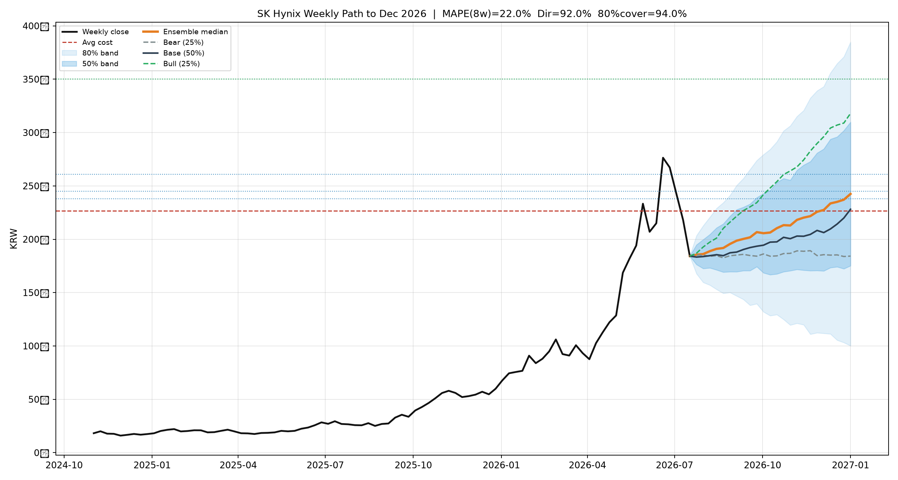
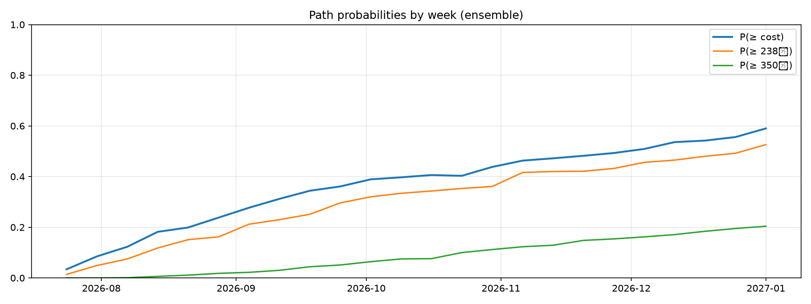

# SK하이닉스 주간 전망 (→ 2026-12) & 액션 플랜

- 기준: **2026-07-17** 주간종가 **1,842,000원** (ATH 대비 -33.4%)
- 시나리오 사전확률: bear 25% / base 50% / bull 25%
- 12월 말: 중앙 **242만** | 80%밴드 100~385만 | bear/base/bull 중앙 184 / 228 / 318만

## 정확도 (Walk-forward)

| 구간 | MAPE | RMSE | 방향정확도 | 80%커버 | 50%커버 | n |
|---|---|---|---|---|---|---|
| 4주-전체 | 11.0% | 14.9% | 71.8% | 85.9% | 69.2% | 78 |
| 8주-전체 | 15.2% | 19.8% | 77.6% | 92.1% | 60.5% | 76 |
| 4주-최근1년 | 14.9% | 18.8% | 83.3% | 85.2% | 53.7% | 54 |
| 8주-최근1년 | 22.0% | 26.7% | 92.0% | 94.0% | 48.0% | 50 |

### 마일스톤 도달 확률 (경로 시뮬레이션)

| 가격 | 8월말 | 10월말 | 12월말 | 연내 한번이라도 |
|---|---|---|---|---|
| 평단 226.5만 | 24% | 44% | 59% | 72% |
| 238만 | 16% | 36% | 53% | 65% |
| 261만 | 9% | 26% | 38% | 52% |
| 350만 | 2% | 11% | 20% | 26% |
| 400만 | 1% | 7% | 15% | 19% |

## 포지션 규칙 (고정)

- 코어 **33주** / 탄약 **9주** / 평단 **2,264,880**
- 현금화: 238·245·261만에서 3+3+3
- 재매수: 매도평균 대비 −12/−18/−25%에 현금 40/40/20 (저점 탄약 남기기)
- 코어익절: 350×12(대출상환) → 375×12 → 400 잔여
- 월 이자 ~90만원: 매도 현금 발생 시 이자+원금 우선

## 주차별 액션

| 주 | 중앙 | base | bull | P≥평단 | P≥238 | 스탠스 | 기본액션 | 현금흐름 |
|---|---|---|---|---|---|---|---|---|
| 2026-07-24 | 186 | 183 | 187 | 3% | 1% | 방어홀드 | 평단 아래 구간 확률 우위 → 매도 없음. 이자 유동성만 확보. 트리거는 예약. | 이벤트창: 매도는 허용, 재매수는 발표 익일 종가 후. | 순유출: 이자 ~주 22만원 수준 |
| 2026-07-31 | 186 | 184 | 193 | 8% | 5% | 방어홀드 | 평단 아래 구간 확률 우위 → 매도 없음. 이자 유동성만 확보. 트리거는 예약. | 이벤트창: 매도는 허용, 재매수는 발표 익일 종가 후. | 순유출: 이자 ~주 22만원 수준 |
| 2026-08-07 | 189 | 185 | 197 | 12% | 8% | 방어홀드 | 평단 아래 구간 확률 우위 → 매도 없음. 이자 유동성만 확보. 트리거는 예약. | 순유출: 이자 ~주 22만원 수준 |
| 2026-08-14 | 191 | 186 | 201 | 18% | 12% | 방어홀드 | 평단 아래 구간 확률 우위 → 매도 없음. 이자 유동성만 확보. 트리거는 예약. | 순유출: 이자 ~주 22만원 수준 |
| 2026-08-21 | 192 | 185 | 210 | 20% | 15% | 방어홀드 | 평단 아래 구간 확률 우위 → 매도 없음. 이자 유동성만 확보. 트리거는 예약. | 순유출: 이자 ~주 22만원 수준 |
| 2026-08-28 | 196 | 187 | 216 | 24% | 16% | 방어홀드 | 평단 아래 구간 확률 우위 → 매도 없음. 이자 유동성만 확보. 트리거는 예약. | 순유출: 이자 ~주 22만원 수준 |
| 2026-09-04 | 199 | 188 | 222 | 28% | 21% | 방어홀드 | 평단 아래 구간 확률 우위 → 매도 없음. 이자 유동성만 확보. 트리거는 예약. | 순유출: 이자 ~주 22만원 수준 |
| 2026-09-11 | 200 | 190 | 227 | 31% | 23% | 방어홀드 | 평단 아래 구간 확률 우위 → 매도 없음. 이자 유동성만 확보. 트리거는 예약. | 순유출: 이자 ~주 22만원 수준 |
| 2026-09-18 | 202 | 192 | 230 | 34% | 25% | 방어홀드 | 평단 아래 구간 확률 우위 → 매도 없음. 이자 유동성만 확보. 트리거는 예약. | 순유출: 이자 ~주 22만원 수준 |
| 2026-09-25 | 207 | 193 | 234 | 36% | 30% | 탈환감시 | 평단 탈환 시도 구간. 종가 2일 연속 226.5만↑ 확인 후 매도계단 가동. | 유입 대기 / 이자 유출 |
| 2026-10-02 | 206 | 194 | 242 | 39% | 32% | 현금화준비 | 상단 터치 확률 유의 → 238부터 탄약 매도 지정가 필수. | 조건부 유입: 탄약 매도 시 주당 238~261만 |
| 2026-10-09 | 206 | 197 | 248 | 40% | 33% | 현금화준비 | 상단 터치 확률 유의 → 238부터 탄약 매도 지정가 필수. | 조건부 유입: 탄약 매도 시 주당 238~261만 |
| 2026-10-16 | 210 | 198 | 254 | 41% | 34% | 현금화준비 | 상단 터치 확률 유의 → 238부터 탄약 매도 지정가 필수. | 조건부 유입: 탄약 매도 시 주당 238~261만 |
| 2026-10-23 | 213 | 202 | 261 | 40% | 35% | 현금화준비 | 상단 터치 확률 유의 → 238부터 탄약 매도 지정가 필수. | 이벤트창: 매도는 허용, 재매수는 발표 익일 종가 후. | 조건부 유입: 탄약 매도 시 주당 238~261만 |
| 2026-10-30 | 213 | 201 | 264 | 44% | 36% | 현금화준비 | 상단 터치 확률 유의 → 238부터 탄약 매도 지정가 필수. | 이벤트창: 매도는 허용, 재매수는 발표 익일 종가 후. | 조건부 유입: 탄약 매도 시 주당 238~261만 |
| 2026-11-06 | 218 | 203 | 268 | 46% | 42% | 현금화준비 | 상단 터치 확률 유의 → 238부터 탄약 매도 지정가 필수. | 이벤트창: 매도는 허용, 재매수는 발표 익일 종가 후. | 조건부 유입: 탄약 매도 시 주당 238~261만 |
| 2026-11-13 | 220 | 203 | 274 | 47% | 42% | 현금화준비 | 상단 터치 확률 유의 → 238부터 탄약 매도 지정가 필수. | 조건부 유입: 탄약 매도 시 주당 238~261만 |
| 2026-11-20 | 222 | 205 | 283 | 48% | 42% | 현금화준비 | 상단 터치 확률 유의 → 238부터 탄약 매도 지정가 필수. | 조건부 유입: 탄약 매도 시 주당 238~261만 |
| 2026-11-27 | 226 | 208 | 290 | 49% | 43% | 현금화준비 | 상단 터치 확률 유의 → 238부터 탄약 매도 지정가 필수. | 조건부 유입: 탄약 매도 시 주당 238~261만 |
| 2026-12-04 | 227 | 206 | 296 | 51% | 46% | 현금화준비 | 상단 터치 확률 유의 → 238부터 탄약 매도 지정가 필수. | 조건부 유입: 탄약 매도 시 주당 238~261만 |
| 2026-12-11 | 234 | 210 | 304 | 54% | 46% | 현금화준비 | 상단 터치 확률 유의 → 238부터 탄약 매도 지정가 필수. | 조건부 유입: 탄약 매도 시 주당 238~261만 |
| 2026-12-18 | 235 | 214 | 307 | 54% | 48% | 현금화준비 | 상단 터치 확률 유의 → 238부터 탄약 매도 지정가 필수. | 조건부 유입: 탄약 매도 시 주당 238~261만 |
| 2026-12-25 | 237 | 220 | 309 | 56% | 49% | 현금화준비 | 상단 터치 확률 유의 → 238부터 탄약 매도 지정가 필수. | 조건부 유입: 탄약 매도 시 주당 238~261만 |
| 2027-01-01 | 242 | 228 | 318 | 59% | 53% | 현금화준비 | 상단 터치 확률 유의 → 238부터 탄약 매도 지정가 필수. | 조건부 유입: 탄약 매도 시 주당 238~261만 |

### 트리거 (매주 공통, 지정가 예약)

IF ≥238만: 탄약 3주 매도 (누적현금↑) [P≈1%]
- IF ≥245만: 탄약 +3주 매도 [P≈1%]
- IF ≥261만: 탄약 +3주 매도 [P≈0%]
- IF 매도평균 대비 −12/−18/−25%: 현금 40/40/20 재매수
- IF ≥350만: 코어 12주 익절→대출상환 [P≈0%]
- IF ≤166만(추가 −10%): 신규매수 금지·홀드 / 여유현금 있을 때만 3차 대기

